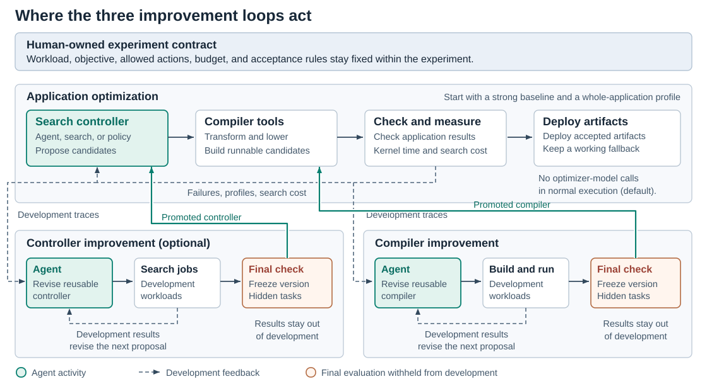
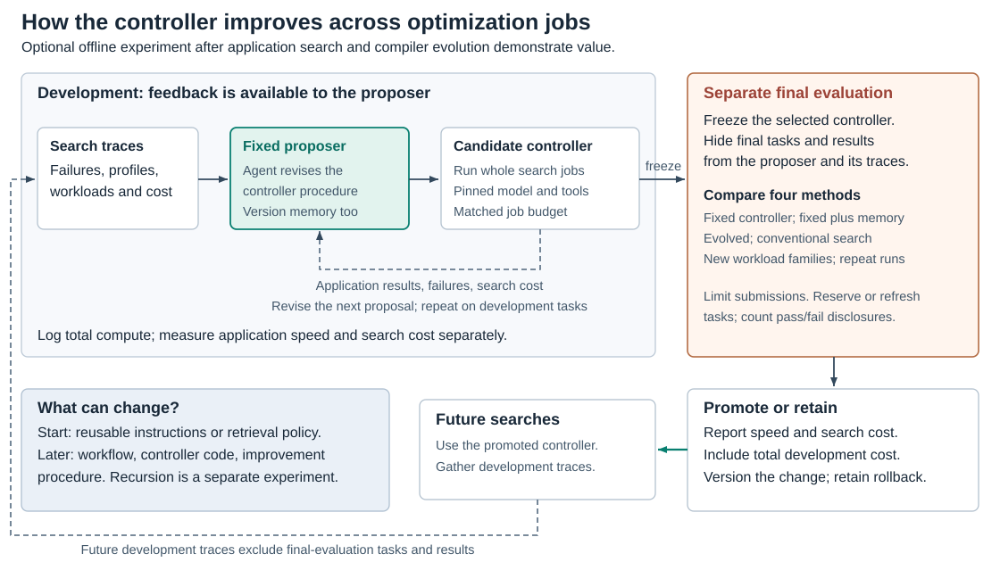

# Next-Generation AI Compiler Survey and Design Guide

Evidence reviewed through **23 September 2026**. Forecasts cover **2027, 2029, 2031, 2036, and the longer-term future**. This is a living research and design document; forecasts are conditional judgments, not established results.

**Central hypothesis:** the compiler increasingly becomes an agentic optimization system that chooses strategies, synthesizes implementations and compiler components, evaluates results, and adapts using feedback. Current systems support parts of this direction. They do not establish one required architecture or a permanent boundary between an agent and a conventional compiler.

**Design priority:** runtime performance first; developer productivity and portability next, with similar importance. Measure search cost from the start. When an improvement will be reused enough to repay its cost, establish performance value before optimizing search expense; for short-lived or latency-sensitive deployment, search cost and payback constrain the design immediately. Cheaper search at comparable runtime is a distinct useful outcome. See the [reuse and deployment tradeoff](#per-workload-optimization-or-offline-compiler-improvement). Correctness, numerical requirements, and deployment constraints define which implementations are acceptable.

Read the purpose and evidence rules first, then the trends and design guidance. The unresolved questions and evidence register explain where recommendations remain uncertain. Detailed source summaries stay in the [publication index](../reference/publications/INDEX.md); this document is the single narrative.

## 0. Purpose and vocabulary

### 0.1 What this survey is trying to decide

The survey has two connected purposes: explain the important directions in AI compilation and test a design thesis for the next compiler. The field review must include strong alternatives to agentic methods, otherwise it cannot test that thesis fairly.

An agentic optimizer here does more than enumerate a fixed set of configurations. It uses a learned model to choose or revise optimization actions, synthesize code or transformations, and respond to analysis or execution feedback. It can call conventional search, a solver, a compiler, or an expert library. The architecture should earn its complexity through measured results.

The thesis has three different strengths:

| Statement | Assessment | Design implication |
|---|---|---|
| Agents can improve selected optimization and compiler-engineering tasks. | Demonstrated in several author evaluations and industry reports. | Treat agents as credible candidates for useful work. |
| Agentic optimization will become a major organizing principle for some future compilers. | Plausible forecast; adoption and scope remain uncertain. | Build interfaces that allow broader autonomy and replacement of components. |
| Every future compiler must use an agent, a particular intermediate representation, or a fixed layer structure. | Not established by the reviewed evidence. | Keep competing architectures in the evaluation. |

Today's failures identify challenges and possible research directions. They do not establish permanent limits. Equally, the possibility of a breakthrough does not establish when it will arrive. Forecast direction, timing, and software architecture separately.

The scope includes model graphs, kernels, memory, communication, runtime specialization, compiler construction, controller improvement, deployment, and hardware/software co-design when linked to executable workloads. Coverage is strongest for accelerator tensor workloads. Mobile, embedded, central-processor-only inference, and non-neural machine learning need more coverage before making claims about the entire field. General chip-design automation and generic coding agents are adjacent topics unless they inform a compiler decision.

### 0.2 Terms used in this guide

| Term | Meaning here |
|---|---|
| AI compiler | A system that translates and optimizes machine-learning programs for execution. |
| AI-assisted compilation | Using learned models or agents to help optimize programs or build compilers. This overlaps with AI compilation but is a different activity. |
| Intermediate representation, or IR | A representation of a program used for analysis, transformation, or code generation. |
| Domain-specific language, or DSL | A language specialized for tasks such as writing tensor kernels. |
| Pass | A unit of compiler analysis or transformation. A pass need not be handwritten or run in a fixed order. |
| Lowering | Turning higher-level computation into a representation or executable closer to the target machine. The function does not require today's sequence of stages. |
| Control plane | The logic that chooses optimization actions and coordinates experiments. |
| Controller improvement | Automatically changing reusable optimizer instructions, workflow, or code and evaluating whether future searches improve. It is distinct from improving the current application or the compiler tools. |
| Compiler substrate | Representations, transformations, analyses, code generation, and tools used by the optimizer. Earlier versions called this the data plane. |
| Validation contract | The inputs, semantics, numerical or statistical acceptance criteria, quality requirements, and operating conditions an implementation must satisfy. |
| Oracle | A source of evaluation feedback, such as a reference implementation, a proof checker, or a benchmark. Each has a defined scope and can be incomplete. |
| Performance portability | Obtaining competitive performance on multiple targets. This can use different target-specific implementations. |
| Hardware bring-up | Making a new accelerator run the required workloads correctly and then efficiently. |

Three uses of **skill** must stay distinct: a vendor's optimization instructions; the Agent Skills packaging specification using `SKILL.md`; and systems that compile skill instructions or manage agent execution state. None of these automatically defines a kernel representation or provides a correctness guarantee. The [Agent Skills specification](../reference/publications/agent-skills-spec.md), [SIGIL](../reference/publications/sigil.md), and [SKILL.state](../reference/publications/skill-state.md) cover different parts of that space.

### 0.3 How to read evidence and forecasts

| Evidence label | What it establishes | What it does not establish |
|---|---|---|
| Documented capability | A public interface or implementation supports a described mechanism. | A performance advantage or broad deployment. |
| Author evaluation | The authors report results under a particular protocol. | Independent reproduction or general superiority. |
| Industry report | An organization reports operational or production experience. | A controlled comparison against every alternative. |
| Corroborated direction | Different systems show a related capability. | Replication of one numerical result or one architecture. |
| Design recommendation | A proposed choice for the stated objectives. | A universal requirement. |
| Forecast | A conditional prediction about future capability or adoption. | An observed result. |

The source catalog's relevance tiers answer a different question. **Tier A** directly informs or challenges a design decision; **Tier B** provides infrastructure or adjacent mechanisms; **Tier C** provides context. A non-agent optimizer can be Tier A. A company blog can be highly relevant while still offering limited evidence for generalization. A star in the index marks a source worth prioritizing, not a quality certification.

Count evidence families, not documents. A paper, blog, talk, and repository for one system do not constitute four independent confirmations. Magellan and AlphaEvolve share a lineage. TritorX and KernelEvolve share a Meta setting. Mirage and Prism share researchers. Record these relationships when assessing confidence.

## 1. What is changing in AI compilation?

### 1.1 Two developments are converging

Compilers for AI are gaining richer representations and more control over hardware execution. AI-assisted compilation is gaining better ways to propose, evaluate, and reuse optimizations. Their convergence is credible, but progress in one does not prove that the other must control the whole system.

A useful survey therefore covers improvements to conventional compilation, structured search, learned policies, agentic synthesis, and combinations of these methods. The question for a designer is which combination produces the best acceptable implementation.

### 1.2 Historical direction

| Period | Development | What carries forward |
|---|---|---|
| 2018-2022 | Tensor compilers, schedule search, and reusable compiler infrastructure expand. | Algorithm/schedule separation, cost models, and retargetable representations. |
| 2020-2023 | Learned compiler policies and reinforcement-learning environments become practical research tools. | Training and evaluation interfaces for optimization decisions. |
| 2023-2024 | Language models begin proposing pass sequences and operating on compiler representations. | Code and compiler knowledge can supply useful search priors. |
| 2025-2026 | Kernel agents, synthesized heuristics, structured feedback, and compiler/agent co-design develop together. | Evaluate the optimizer and the environment it can change. |

These periods overlap. New methods do not make earlier methods obsolete by definition.

### 1.3 Six trends that matter for design

Two changes organize these trends: **what the compiler can optimize** and **how it chooses changes**. Expanding scope across kernels, communication, memory, precision, and runtime creates pressure to coordinate decisions; agentic control is one candidate response. Compiler components can also become optimization targets. This is a causal hypothesis to test, not proof that a large search space requires agents: structured search, decomposition, and conventional compiler methods remain alternatives.

#### Hardware decisions are becoming more explicit

TileLang, Triton Gluon, Triton Low-level Language Extensions, CuTe DSL, FlyDSL, Pallas, CUDA Tile, and TVM TIRx expose different combinations of tiles, layouts, memory spaces, synchronization, and scheduling. Helion provides a higher-level interface with substantial automatic tuning. Their common lesson is to preserve access to decisions that affect performance, while allowing automation to handle details when it performs well.

The design choice is the balance between automation and explicit control. A high-level interface can reduce effort and enable retargeting; a lower-level interface can expose a new hardware capability before an automatic optimizer supports it. Neither choice establishes one universal representation. An [independent CUDA Tile evaluation](../reference/publications/cutile-evaluation.md) shows the cost of an immature target: the same short attention kernel was the fastest tested implementation on one Blackwell GPU and slower than FlashAttention-2 and Triton on another. See the source summaries for [TileLang](../reference/publications/tilelang.md), [Gluon](../reference/publications/triton-gluon.md), [CuTe DSL](../reference/publications/cute-dsl.md), [Pallas](../reference/publications/pallas.md), and [TIRx](../reference/publications/tirx.md).

#### Optimization is expanding beyond isolated kernels

[Triton-distributed](../reference/publications/triton-distributed.md) and its related [DITRON compiler](../reference/publications/ditron.md) coordinate computation and communication. DITRON reports application gains without agentic control, including gains from overlap despite slower individual matrix multiplications. [Shardy](../reference/publications/shardy.md) handles tensor sharding, while [Event Tensor](../reference/publications/event-tensor.md) addresses dynamic dependencies. These are compiler directions in their own right; an agent is not a prerequisite for studying them.

**Design consequence:** expand the optimization boundary when communication, memory movement, launch overhead, or runtime scheduling dominates. Do not infer that every workload needs one giant kernel or one controller for an entire fleet.

**Testable hypothesis:** with comparable performance headroom, feedback, and resources, agents may gain more over strong non-agent methods when decisions interact and existing rules are incomplete. Test mature local-kernel tasks against coupled application tasks, while giving both methods the same action space and information. Measure held-out application gain, failures, and cost. Equal or better non-agent results in the coupled tasks would weaken the hypothesis. A larger space can also make agent search worse; advantage need not increase monotonically with size.

#### Several search methods remain competitive

[Mirage](../reference/publications/mirage.md) and [Prism](../reference/publications/prism.md) use structured search and equivalence reasoning. [MLGO](../reference/publications/mlgo-llvm-docs.md) embeds learned decision policies. [Helion's language-model-guided tuner](../reference/publications/helion-llm-autotuning.md) combines model proposals with conventional refinement.

**Design consequence:** compare methods under the same objective and validation contract. An agent can use these methods as tools; describing the surrounding system as agentic does not establish the value of its reasoning component.

#### Agentic optimization has useful measured results

[KernelEvolve](../reference/publications/kernelevolve-blog.md), [GEAK](../reference/publications/geak-v4-github.md), [Hyperloom](../reference/publications/hyperloom.md), [CAKE](../reference/publications/cake.md), and [Ave, previously Argus](../reference/publications/argus.md) provide evidence across different workloads and organizations. [MaxKernel](../reference/publications/maxkernel.md) extends the picture to Pallas on tensor processing units.

The reported results mix kernel speed, application throughput, search efficiency, and operator coverage. Keep these outcomes separate. KernelBench-X finds that 46.6% of correct generated kernels are slower than its PyTorch eager baseline; that is a result for the evaluated methods and protocol, not a future ceiling. [Benchmark source](https://arxiv.org/abs/2605.04956v1). [KernelBench-Verified](../reference/publications/kernelbench-verified.md) shows how much the protocol matters: with TF32 enabled in the FP32 PyTorch baseline and hidden input transformations, the best single-turn model’s mean speedup falls from 1.43 to 0.88 times. In BF16, where the baseline already uses Tensor Cores, the same model reaches 1.63 times on fused-operator problems.

#### Feedback is becoming more informative

Compiler diagnostics, profilers, reference tests, invariant checks, and equivalence tools can explain why a candidate failed. CAKE supplies localized schedule and hardware findings. Ave checks specified data-flow relationships. [AsmEvo](../reference/publications/asmevo.md) checks assembly edits against an existing binary. [T-LLM Compiler](../reference/publications/t-llm-compiler.md) combines compiler feedback with verification tools.

These checks cover different failure modes. Successful compilation, sampled numerical agreement, bounded verification, and application-quality validation are not interchangeable guarantees. There is no single weakest-to-strongest ordering that applies to all of them.

#### The compiler itself can become an optimization target

[Magellan](../reference/publications/magellan.md) evolves compiler heuristics. CAKE describes changes to its representations and compiler harness. AsmEvo operates after conventional compilation. [Compiler 2.0](../reference/publications/compiler-2.0-cgo2026.md) and [MOCHA](../reference/publications/compiler-2.0-mocha-aarno.md) provide broader research agendas for compiler construction and retargeting.

**Design consequence:** allow the system to improve its tools as well as its programs. Validate generated compiler components across workloads, because an improvement for one kernel can create regressions elsewhere. A component authored by an agent can still execute deterministically.

The optimization controller can also become a target. Changing its reusable instructions or search workflow is a different experiment from changing a kernel or compiler pass. [GEPA](../reference/publications/gepa.md) supplies limited kernel-specific prompt-evolution evidence; broader controller-code and recursive-improvement studies are mostly adjacent agent research. This guide now treats controller improvement as an explicit research direction, with its own evaluation rather than an assumed property of every agentic compiler.

### 1.4 Where to look for evidence

| Source community | Useful evidence |
|---|---|
| Compiler and systems conferences | Mechanisms, evaluation protocols, artifacts, and reproduction studies. |
| Machine-learning conferences | Learned optimization policies, synthesis methods, and benchmark design. |
| LLVM, OpenXLA, PyTorch, TVM, and vendor documentation | Supported interfaces, deployment constraints, and changes to compiler infrastructure. |
| First-party engineering reports | Production workloads and practical integration experience, with attribution limits. |
| Research agendas and public programs | Plausible future directions; distinguish plans from completed evaluations. |

### 1.5 Public visions and their limits

Compiler 2.0 emphasizes better abstractions and machine learning for building and retargeting compilers. MOCHA connects learned rewrite generation with structured search and checking. [Compiler.next](../reference/publications/compiler-next.md) extends compilation ideas to applications built around models, prompts, and agents. [The New Compiler Stack](../reference/publications/new-compiler-stack-survey.md) organizes language-model/compiler interactions.

Use these visions to formulate experiments. Funding, an architectural proposal, or a compelling demonstration does not establish that an approach will become the dominant implementation.

## 1b. Choosing among conventional, learned, and agentic optimization

The following are design alternatives. A product may use more than one.

| Approach | Why choose it? | Main limitation | Evaluation question |
|---|---|---|---|
| Fixed passes and expert libraries | Predictable execution, mature coverage, and strong existing implementations. | A fixed search space can miss workload-specific opportunities. | How much application performance remains beyond the best configured baseline? |
| Structured search or superoptimization | Explore combinations systematically and exploit known semantics. | Representation and pruning choices restrict the searchable space. | Does it find better implementations within a useful budget? |
| Learned policies inside the compiler | Make repeated decisions cheaply after training. | Generalization and training-data coverage require maintenance. | Does the policy improve held-out workloads and new compiler versions? |
| Agent-guided search and synthesis | Use contextual reasoning and generate implementations beyond a fixed parameter grid. | Requires effective feedback; results and cost can vary. | What does adaptive reasoning add beyond the same tools with conventional search? |
| Agent-generated compiler components | Amortize a useful heuristic or transformation across many compilations. | Compiler changes have a broad regression surface. | Do generated components generalize beyond the search workload? |

For performance-first design, retain the best validated candidate found by any method. An agent should not win an architecture comparison simply because it produced more candidates, used more hardware, or changed the numerical contract. Conversely, a costly search can be worthwhile when its result is reused extensively.

A useful first experiment compares a strong conventional pipeline, structured search, an agent restricted to the same actions, and an agent allowed to synthesize new implementations. Report performance at matched budgets and the best attained performance under a larger declared budget. This separates search efficiency, search-space expressiveness, and the value of synthesis.

## 2. How agents can help

### 2.1 Mechanisms and appropriate uses

| Mechanism | Practical use | What to verify |
|---|---|---|
| Propose promising configurations | Seed tuning with workload and hardware context. | Whether proposals improve search efficiency or the final implementation. |
| Synthesize kernels and transformations | Explore fusion, schedules, algorithms, or low-level code. | The declared semantics and numerical requirements. |
| Diagnose failed or slow candidates | Use compiler findings and profiles to target the next change. | Whether the diagnosis predicts a measurable improvement. |
| Choose optimization scope | Move between graph, kernel, communication, and runtime decisions. | Application benefit after integrating all changes. |
| Evolve compiler components | Generate heuristics, analyses, or backend support. | Regression behavior on a separate workload corpus. |
| Reuse accumulated experience | Retrieve useful implementations and unsuccessful experiments. | Compatibility with the current hardware, software, and input assumptions. |
| Improve the controller | Propose reusable instruction, workflow, or controller-code changes. | Better future searches on separate tasks after accounting for development and evaluation cost. |

Reasoning Compiler combines language-model proposals with tree search; ACCLAIM explores multiple abstraction levels; CompileIQ exposes internal tuning controls; Magellan evolves executable heuristics. These are different mechanisms, not interchangeable implementations of one proven agent architecture.

### 2.2 A practical optimization loop

1. Define the workload, performance metric, and validation contract.
2. Capture a strong baseline and profile the complete execution.
3. Choose a promising region or interacting set of decisions.
4. Generate candidates using conventional search, learned policies, an agent, or a combination.
5. Reject candidates that violate the applicable checks; compile or materialize the survivors.
6. Measure candidates on the target and integrate promising ones into the application.
7. Keep improvements that satisfy the contract; retain a usable fallback and an experiment record.
8. Use the findings to improve future proposals. Where justified, open a separate experiment to change the reusable controller or compiler tools.

This is a reference workflow. Cheap static checks can happen before compilation; some checks require execution. Candidate generation and validation can run in parallel when resources allow. The workflow does not require one specific agent topology.

### 2.3 Boundaries that should be explicit

The optimizer can propose changes to programs, transformations, or evaluation tools. It should not silently redefine the acceptance criteria to make its own output pass. Changing numerical tolerances, supported inputs, or model-quality requirements is a separate design decision.

Record whether a candidate was tested, formally checked within a modeled subset, or validated in an application. Keep evaluation inputs separate from search feedback when measuring generalization. This is especially important when the system can modify its own harness.

### 2.4 Three targets of improvement

An agent in the control plane can optimize applications without changing its own implementation. Distinguish the artifact that persists after an experiment:

| Target | What changes | What must improve |
|---|---|---|
| Application | Kernels, fusion, layouts, placement, or the runtime plan. | The accepted application's execution under its contract. |
| Controller | Reusable instructions, search strategy, retrieval policy, orchestration, or agent code. | The quality or cost of future optimization jobs. |
| Compiler | Analyses, transformations, representations, or backend implementation. | Compilation outcomes across supported workloads and targets. |

For example, trying another tile after a slow measurement changes the current search. Retaining an automatically proposed policy for deciding when to stop tile search and explore fusion changes the controller. Generating a reusable lowering transformation changes the compiler. One agent can perform all three jobs; these are evaluation boundaries, not a requirement for three agents or permanent software layers.

Here, **control-plane self-improvement** means an automatic process proposes, evaluates, and retains a reusable controller change. A separate optimizer may perform that process. Reserve **recursive self-improvement** for the stronger case where the mechanism that proposes improvements also changes. Persistent experience can adapt later behavior without either kind of code rewrite; merely storing logs establishes neither improved behavior nor an improved controller.

Use one rule to classify an edit: a controller change alters the decision procedure — instructions, search strategy, retrieval logic, orchestration, or agent code — not merely the data the procedure has stored. Adjusting stored experience alone is memory adaptation, not controller improvement. A retained decision procedure such as a learned stopping rule can also count as a learned policy in the alternatives comparison; classify it by what persists and evaluate it here whenever the reusable procedure, rather than its data, is what changes.

## 3. How compilation processes may change

### 3.1 Keep necessary functions; reconsider their implementation

| Function | What must be achieved | What remains optional |
|---|---|---|
| Represent computation | Preserve enough information to implement and evaluate the workload. | One common representation, multiple representations, or task-specific forms. |
| Transform and optimize | Find an acceptable implementation with better performance. | Handwritten passes, learned selection, generated rewrites, or direct synthesis. |
| Map to hardware | Produce runnable code with the required execution behavior. | Fixed staged lowering, adaptive paths, generated backends, or direct low-level generation. |
| Validate | Establish confidence under an explicit contract. | The combination of analyses, proofs, tests, simulation, and deployment checks. |
| Coordinate execution | Respect dependencies and resource constraints. | A conventional runtime, persistent kernels, static schedules, or adaptive policies. |

Passes are useful units of implementation and review. They are not a required user-facing abstraction. Lowering describes a function; it does not establish that today's lowering sequence must survive.

### 3.2 Current challenges and plausible solution paths

| Current challenge | Possible path forward | Evidence that would show progress |
|---|---|---|
| Fluent code generation can still misunderstand program semantics. | Better representations, training data, analyses, and equivalence feedback. | Higher validated coverage on unseen programs without relaxed contracts. |
| Correct kernels can still be slow. | Combine profiling, performance models, structured search, and learned proposals. | Better application performance, including failures and regressions in the denominator. |
| Fusion, asynchronous execution, and numerical behavior are difficult to validate. | Explicit dependencies, numerical contracts, invariant checks, and scoped proofs. | Fewer escaped errors on broader workload and input distributions. |
| New hardware has little training data. | Use hardware specifications, simulators, compiler traces, and targeted experiments. | Competitive performance and coverage on genuinely new targets. |
| Search is expensive. | Reuse results, improve proposal quality, learn small policies, and generate reusable heuristics. | Better performance-versus-budget curves. |
| Changing the compiler can break unrelated workloads. | Separate evaluation sets, component-level checks, reproducible builds, and staged deployment. | Sustained improvements after compiler and workload updates. |

Negative results from mlirAgent, LLM4IR, and KernelBench-X motivate these tests. They do not determine the capabilities of models or compilers five or ten years from now.

### 3.3 A starting architecture with replaceable components

Start with a workload specification, an experiment coordinator, several candidate-generation methods, compilation and analysis tools, evaluation, and a store of accepted artifacts. Keep the interfaces explicit enough to compare or replace each component.

*Figure 1. One possible starting architecture.* Each development loop uses application-search evidence and returns development results to its proposer. Selected versions face separate final evaluation before promotion. The three targets do not require three agents or permanent layers. Normal execution reuses accepted artifacts; online optimizer calls remain an optional design choice.

Humans establish the workload, objective, and validation contract for an experiment. Application candidates can come from agents, conventional search, learned policies, or a combination. Compiler development repeatedly builds and evaluates proposed toolchain changes on development workloads; a selected version then faces separate regression and performance evaluation. Controller development repeatedly runs complete application-optimization jobs with proposed controller versions. Neither development loop receives final-evaluation tasks or results as proposal feedback. Acceptance rules stay fixed during the experiment; changing those rules is a separate design decision.

In this starting design, there are **no optimizer-model calls during normal execution**. The deployed application can itself contain models, and its execution need not be deterministic. Retain a working fallback and use production profiles to identify fresh optimization work. Each component can be retained, generated, merged, or replaced as described in the [architecture choices](#514-decide-what-to-retain-generate-merge-or-replace).

For example, initially use an existing backend to implement a generated schedule. If backend limitations repeatedly prevent useful schedules, evaluate a new lowering path or a generated backend component against the existing path. If a direct assembly optimizer improves the final artifact, include it as another candidate-producing stage. Decide from measured behavior rather than from a rule that agents must always remain above the backend.

## 4. Gaps that guide the research agenda

These gaps concern evidence, capability, and deployment. They are challenges to investigate, not permanent restrictions on the future architecture.

### 4.1 Application-level evidence

Kernel and pass-level gains are abundant relative to controlled application comparisons. KernelEvolve reports production throughput improvements; Hyperloom and GEAK describe application optimization loops. Their settings differ from public benchmark suites.

**Design guidance:** select representative training or serving workloads before optimizing. Fix the baseline, precision, quality criteria, hardware, and workload mix. Attribute gains from kernels separately from framework, batching, caching, or runtime changes. Long-running production evaluation strengthens deployment confidence, but is not a prerequisite for a useful research result.

Profile the **addressable fraction**: the time that the permitted optimization actions can actually change. The [kernel-headroom study](../reference/publications/kernel-headroom.md) is an instructive, narrow example: its table projects 1.32–2.49% transformer time savings on selected A100 profiles. Its 58.2% recommender figure is the total addressable share; one embedding kernel is 37.4%. These are not KernelEvolve’s private workloads, so the study cannot explain that system’s reported gains directly.

**Illustrative calculation:** if an affected region occupies 10% of serial runtime and becomes twice as fast, total runtime falls by 5%; application speedup is about 1.053 times. This assumes other work is unchanged. An 80–86% library share alone therefore does not imply a 1% ceiling. Library optimality, achievable kernel gains, and the allowed actions are additional assumptions. With overlapping execution, measure effects on the critical path instead of adding overlapping kernel durations. Fusion, communication changes, or algorithm changes can alter the addressable fraction itself.

### 4.2 Correctness and numerical behavior

| Check | What it can establish | Important limit |
|---|---|---|
| Compiler checks and known transformations | Structural validity and properties enforced by the implementation. | A compiler can contain bugs; generated transformations need their own justification. |
| Reference and operator tests | Agreement on tested inputs and argument combinations. | Finite tests do not cover all executions. |
| Numerical and model-quality checks | Compliance with declared error and application-quality requirements. | A tolerance can be inappropriate for a different model or use. |
| Invariant and equivalence checking | Properties within the modeled language, assumptions, and checking scope. | Arithmetic models, concurrency, bounds, and invariant completeness matter. |
| Application replay and staged rollout | Behavior under representative execution and production conditions. | Rare inputs, drift, and interactions can still be missed. |
| Stochastic or nondeterministic execution | Repeated trials estimate error and quality distributions under specified device states; check confidence bounds and tail requirements. | Finite samples and imperfect noise models can miss rare failures, drift, or untested conditions. |

Combine checks according to the allowed action. A configuration change, a new reduction order, and a generated backend require different evidence. Ave's data-flow assertions and CAKE's schedule checks are useful examples of targeted feedback, not complete proofs for arbitrary accelerator programs.

Stochastic hardware can still have a deterministic mathematical reference; what changes is the acceptance rule. Specify repeated-trial sampling, allowed error or quality loss, failure probability, and operating conditions. IBM’s [analog-hardware evaluation tutorial](../reference/publications/analog-validation.md) already treats variation and drift explicitly. Model-quality checks can therefore be extended to statistical contracts; their meaning is not undefined.

### 4.3 Search cost and reproducibility

Track model calls, tokens, compilation time, device time, failed trials, and elapsed optimization time. Preserve the accepted artifact, its dependencies, and enough records to rerun the measurement. Replaying an accepted artifact is different from reproducing the exact stochastic search trajectory.

For reusable improvements, establish attainable performance before concentrating on cheaper search. For deployment-specific search, check its latency and payback at the outset. Without cost measurement, an architecture comparison can confuse a better method with a larger budget. Cache results only when the input assumptions, target, compiler, and validation contract remain compatible.

A simple decision rule compares search, integration, and maintenance cost with the expected saving over all executions before the artifact becomes invalid. Use one declared accounting unit and separately enforce wall-clock deployment deadlines; tokens, device time, and engineer time are not interchangeable quantities. Count failed attempts as part of the cost of an accepted artifact. One search per deployment can still serve millions of executions, while fleet-wide heuristics still require maintenance. Report campaign totals separately from per-artifact costs.

Helion illustrates a useful alternative outcome: cheaper tuning at roughly comparable final latency. Under an agreed performance tolerance, that is a search-efficiency improvement even without a runtime gain. Keep the two results separate and check per-shape regressions; the tolerance must be chosen before evaluation.

### 4.4 Interoperability across compiler stacks

A portable experiment interface can describe workloads, candidate actions, results, and artifact identity even when each backend uses a different language. This can reduce integration effort without assuming a universal executable representation.

The alternative, a more unified representation, remains worth testing. Compare expressiveness, target performance, validation effort, and maintenance cost. Existing fragmentation is evidence about today's ecosystem, not proof that future consolidation cannot work.

### 4.5 Interfaces that expose hardware-relevant decisions

Expose layouts, synchronization, memory use, available instructions, and profiling results where they affect performance. Prefer structured information where it prevents ambiguity; retain source-code and diagnostic access where a rigid schema would hide important details.

The open question is how much structure helps the optimizer. An interface that makes experiments reliable is valuable; an interface that excludes the winning implementation limits attainable performance. Compare both restricted and wider action spaces under the same evaluation.

### 4.6 The optimizer's own workflow and memory

The controller is now a research target in its own right. The evidence supports several mechanisms with different scopes; it does not establish a single self-evolving compiler architecture.

| Mechanism | Relevant evidence | What remains unproven for this compiler design |
|---|---|---|
| Evolve reusable instructions | [GEPA](../reference/publications/gepa.md) changes prompts used by kernel-generation agents. | Application benefit and transfer of the learned controller to unseen workload families under comparable total budgets. |
| Adapt through persistent experience | [KOPE](../reference/publications/kope.md) describes kernel-search memory with a fixed model. | Full-text protocol verification is pending; memory adaptation does not establish autonomous workflow rewriting. |
| Search workflow or harness code | [Automated Design of Agentic Systems](../reference/publications/adas.md), [AFlow](../reference/publications/aflow.md), and [Meta-Harness](../reference/publications/meta-harness.md) generate agent designs or harnesses. | Their broader-task results need compiler-specific evaluation; the outer optimizer need not change. |
| Let agents edit their own implementation | [Self-Improving Coding Agent](../reference/publications/self-improving-coding-agent.md) and [Darwin Gödel Machine](../reference/publications/darwin-godel-machine.md) evaluate agent-code changes. | Coding-task gains do not establish better compiler-search decisions. |
| Change the improvement procedure itself | [Hyperagents](../reference/publications/hyperagents.md) makes the agent-modification procedure editable. | Compiler transfer and sustained gains remain open; its main experiments still fix parts of selection and evaluation. |

**Assessment:** there is direct but narrow kernel evidence for instruction improvement, adjacent evidence for broader controller redesign, and an abstract-only kernel-memory lead. Full compiler-controller self-evolution is a hypothesis to test. Automated Design of Agentic Systems, Darwin Gödel Machine, and Hyperagents share a research lineage; Meta-Harness and GEPA also have author overlap. Count these dependencies instead of treating every paper as independent confirmation.

**No application-level evidence yet.** Note the ceiling on today's direct evidence: the strongest controller-improvement result is a hardware-utilization proxy on a single target and model, not a runtime or application measurement. No study yet shows a retained controller change improving end-to-end application performance in a compiler under a fixed contract. Treat control-plane self-improvement as unproven at the application level for this design, not merely as under-replicated.

[FlowCompile](../reference/publications/flowcompile.md) provides a structured workflow-optimization alternative. AgentFlow supplies analysis, while Auto and skill-compilation research explore reusable execution artifacts. DeepSeek Harness and SKILL.state provide runtime and state-management mechanisms. Such infrastructure can support an evolving controller, but analyzing, compiling, or hosting a workflow does not demonstrate that it improves itself. AFlow, AgentFlow, and FlowCompile are distinct systems.

The main gap is a controlled compiler experiment. A persistent controller change should improve fresh searches, not merely replay a successful kernel or benefit from more accumulated device time. Version the controller and its memory snapshot separately from executable artifacts and compiler components. Keep search traces for diagnosis and evaluation tasks separate from those traces. Test stale or misleading memories after workload and hardware changes, and measure the cost of maintaining the controller as well as running it.

### 4.7 Training and evaluation data

ComPile and Meta LLM Compiler provide compiler-representation data. KernelBook, TritonRL, DRTriton, and AMDKernelVault provide kernel-generation or training resources. Their data sources and validation differ.

Record failed compilations, numerical errors, and correct-but-slow candidates as well as successes. Separate training data, optimization feedback, and final evaluation. Test transfer across models, shapes, hardware, and compiler versions. More samples of one familiar representation do not by themselves demonstrate broad portability.

### 4.8 Human review and maintenance

Assign ownership to accepted compiler changes and generated kernels. Measure review effort and escaped defects, not only the number of generated patches. Compiler-specific tools such as Archer and llvm-harness provide relevant evidence; generic code-review automation alone is weaker evidence for semantic compiler changes.

Automate acceptance only for action classes with adequate checks. Larger changes can become more autonomous as the evaluation improves. Human review requirements are a deployment choice and current confidence measure, not a permanent limit on synthesis.

### 4.9 Security and artifact provenance

Run generated candidates with appropriate isolation, preserve where released artifacts came from, and control which tools and files optimization jobs can change. Protect proprietary workloads and hardware documents according to their actual access requirements. These are implementation responsibilities for deployed optimization systems, not evidence for a specific compiler layer structure.

### 4.10 Comparable benchmarks

Use a progression from compiler transformations to individual kernels, fused regions, complete applications, and multi-device execution. Include new-hardware enablement where relevant. KernelBench, KernelBench-X, KernelBench-Verified, FlashInfer-Bench, JAXBench, KernelGenBench, and llvm-bench each cover part of this space.

For every result, record the denominator, validation scope, workload coverage, target, software versions, budget, and variability. Configure the baseline as practitioners would deploy it, including precision modes such as TF32, and test correctness on inputs the generator did not see; [KernelBench-Verified](../reference/publications/kernelbench-verified.md) found shortcuts that assumed positive inputs. Record peak memory as well as time. Report the fraction of workloads that are correct and faster, the size of gains and regressions, and application benefit. Do not average unrelated headline speedups into a single ranking.

## 5. Design guidelines and forecast

The guidance below is intended for designing a next-generation compiler. It is deliberately performance-first and architecture-flexible. Recommendations should change when better experiments become available.

### 5.1 Design the system around measurable decisions

#### 5.1.1 Choose the objective before the architecture

For training, minimize representative step time while preserving the required training behavior and resource limits. For serving, maximize throughput under explicit latency and quality constraints, or minimize latency under an explicit load. For edge deployments, startup, memory, and energy may also be hard constraints.

Developer productivity and portability are secondary objectives of similar importance. Record implementation effort and the work needed to reach competitive performance on another target. For a new accelerator, sufficient operator coverage is an enabling condition: a fast isolated kernel cannot run an unsupported application.

**Caveat on the objective order.** This ordering describes the frontier training and serving segment, where runtime dominates cost and the workload already runs. It is not universal. For new-accelerator bring-up, edge deployments, and the long tail of non-frontier organizations, workload coverage and portability are often the binding constraint and act as the effective primary objective until enough of the application runs to measure performance at all. State the deployment segment when applying this order, and reverse it when coverage or portability, rather than runtime, is what blocks the application. The unresolved question on coverage against peak performance discusses how to allocate work in these cases.

**Example:** if serving throughput is the objective, a faster matrix multiplication is useful only to the extent that it improves the complete serving path. Profile whether the application is instead limited by communication, memory, scheduling, or another operator. Let those findings select the next experiment.

#### 5.1.2 Expose useful decisions without prescribing a layer count

| Decision area | Examples of choices to expose | When to combine it with another area |
|---|---|---|
| Workload and graph | Supported shapes, partitioning, fusion, specialization. | When graph boundaries prevent a useful kernel or memory optimization. |
| Representation and transformation | Layout, memory planning, algebraic rewrites, pass selection. | When local decisions constrain later schedules. |
| Kernel and machine code | Tiling, pipelining, synchronization, instructions, registers. | When backend behavior determines whether a schedule performs well. |
| Runtime and distribution | Dispatch, batching, dependencies, placement, communication. | When application bottlenecks cross device or kernel boundaries. |
| Evaluation and deployment | Validation, measurement, artifact selection, rollout. | When optimization and deployment assumptions differ. |

These are a checklist of responsibilities, not five required software layers. Central processing unit (CPU) and accelerator paths can share or separate components as useful. Energy and operating cost can be objectives or constraints; whether they need dedicated representations is an open implementation question.

A shared interface can expose several representations. A unified representation may also be effective. Avoid predicting a fixed count from the number of concerns in today's stacks.

#### 5.1.3 Coordinate choices when their performance interacts

**Recommended starting point:** use profiles and local models to identify promising changes, then measure integrated candidates on the application. Revisit earlier decisions when later choices change their value. Joint search is particularly useful to test when fusion, tiling, communication, and placement interact.

**Benefit:** the system can find gains that optimizing each component once would miss. **Cost:** the search space and attribution problem grow. **Alternative:** retain local optimizers when their decisions are sufficiently independent and composition performs well. A single central controller is not necessary merely because the application objective is global.

**Test:** compare independent optimization, coordinated search, and broader synthesis under the same workload and budget. Include a larger-budget comparison to examine attainable performance. The objective is better measured performance; no general proof of a global optimum is claimed. DITRON provides a concrete non-agent comparison for communication and execution decisions; an agent must add value beyond expanding the action space alone.

#### 5.1.4 Decide what to retain, generate, merge, or replace

| Architectural choice | Useful starting point | Reason to choose differently | Evidence needed |
|---|---|---|---|
| Existing passes | Reuse mature transformations. | Their action space misses a valuable implementation. | Generated transformations or direct synthesis improve held-out workloads. |
| Fixed lowering pipeline | Reuse a functioning backend. | It loses important schedule information or cannot express target capabilities. | An alternative path preserves the contract and improves performance or coverage. |
| Existing kernel language | Use a language with strong tooling and target support. | Representation complexity or hidden scheduling limits search. | Controlled comparison against strong existing languages and interfaces. |
| Separate agent and compiler | Keep components independently testable. | Compiler and optimizer co-evolution benefits from tighter integration. | Better results with comparable validation and maintenance effort. |
| One coordinator or several agents | Start with the simplest system that handles the task. | Specialization or parallel exploration yields better results. | Ablations isolate those benefits from extra budget. |
| Compile-time or offline optimization | Reuse accepted artifacts where workloads are stable. | New shapes or operating conditions justify adaptation. | The performance gain pays for adaptation within deployment constraints. |

Replacement is incremental. Generating a new heuristic, replacing a transformation, changing the representation, or bypassing part of lowering all count as architectural change. Retaining an assembler, checker, or fallback does not mean the rest of the compiler has remained conventional.

#### 5.1.5 Add controller improvement as a separately evaluated loop

**Recommended starting point:** keep a strong fixed controller and allow offline proposals to change a small, versioned part of it, such as the reusable optimization instructions or retrieval policy. Use ordinary application-search runs to gather development evidence, then evaluate proposed controller versions on separate workloads. Keep the compiler tools fixed for this first comparison. Only accepted controller versions guide subsequent searches.

*Figure 2. Controller development with a separate final evaluation.* Development jobs return application results, failures, and search cost to the proposer. A selected controller is frozen before final evaluation; final tasks and results stay outside development feedback. Promotion affects future searches. Application-level benefit remains unproven in the reviewed evidence; recursive improvement is a further experiment.

Within development, the proposer changes a controller, runs that version through complete application-optimization jobs, examines their results, and revises its next proposal. A controller that merely replays a known winning executable has not demonstrated better search. Record controller versions and memory snapshots separately, and measure the accepted application's performance as well as the resources spent finding it.

This creates three connected loops: application search produces executables; controller development produces a new optimizer version; compiler evolution produces a new toolchain version. Controller development can use the same agent infrastructure as the other loops. It need not run on the application's execution path, modify model weights, or rewrite its own improvement procedure.

**Benefit:** one controller improvement may help many future workloads. **Tradeoff:** evaluating it requires many complete search jobs, and repeated selection can overfit the development set. Broader controller-code edits become worth testing when restricted changes leave measurable failures. Recursive modification of the improvement procedure is a further experiment, not a prerequisite. Prefer a fixed controller when adaptation fails to transfer or cannot repay development and maintenance cost.

**Priority caveat.** This is the most expensive loop to evaluate, because its unit of measurement is many complete search jobs on held-out families rather than a single compile. Under the performance-first objective and the guidance to improve search economics last, treat controller self-improvement as a late-stage, gated activity: pursue it only after the application-search and compiler-evolution loops deliver repeated value. The build sequence lists it before final cost reduction for continuity, but its near-term return is usually the lowest of the three loops, so do not schedule it as routine mid-build work.

**Validation experiment:** compare a strong fixed controller, that controller with persistent memory, a controller with evolved instructions or workflow, and a conventional configuration-search baseline. Give them the same compiler actions, hardware access, feedback, model version, and validation contract. Match per-job resources and separately report all controller-development costs; also show performance-versus-budget curves. Hold out workload families and input shapes, repeat noisy measurements, and count failures. Measure the best accepted application performance and the cost to reach it. A cheaper search at comparable application speed is useful, but it is a different result from a faster executable.

Freeze the proposed controller for the initial held-out evaluation. A separate continual-adaptation experiment may update it between tasks, but must disclose task order and prevent future evaluation information from leaking backward. Keep acceptance rules outside the proposed edits. When both the controller and compiler evolve, first measure each change separately, then measure their combination to detect interactions and attribute gains.

**Final-evaluation policy:** read-only access is insufficient to prevent overfitting. Keep final tasks, inputs, and detailed results outside proposer access and development traces. Declare a submission limit and a reserved or refreshable workload pool before promotion testing. Even pass/fail promotion decisions reveal information, so count those submissions; once a task or result is disclosed for development, retire it from the unseen pool. Report the evaluation history and use fresh reserved workloads for later generalization claims. Apply the same separation when evaluating compiler changes.

The dominant practical threat is attribution rather than contamination alone: a measured gain can come from a newer model snapshot, toolchain drift, or simply more accumulated compute rather than from the controller change itself. Pin the model and toolchain versions for the duration of the comparison, log total compute and wall-clock for every accepted change, and reject a controller version whose apparent benefit does not reproduce under the same fixed versions and a matched budget.

### 5.2 A practical sequence for a first implementation

1. **Establish the workload and baseline.** Use an application that matters, a strong compiled or library baseline, and explicit semantics and numerical requirements.
2. **Make experiments dependable.** Add candidate identity, repeatable compilation, validation, timing, and a usable fallback.
3. **Compare optimization methods.** Evaluate conventional search, learned policies where available, and agent proposals with the same feedback and resources.
4. **Expand the action space.** Permit new kernels, cross-operator transformations, or machine-code edits where restricted tuning leaves measurable opportunity.
5. **Coordinate interacting decisions.** Add runtime and communication choices when profiling shows that they matter.
6. **Evolve the compiler selectively.** Turn recurring limitations into proposed analyses, transformations, or backend changes; validate against a separate corpus.
7. **Evaluate controller improvement.** Compare persistent experience, evolved instructions, and workflow changes on fresh optimization jobs before allowing broader self-modification.
8. **Generalize and reduce cost.** Extend shapes and targets, improve developer interfaces, reuse successful work, and reduce search expense.

This sequence is a starting recommendation, not a requirement to solve each stage completely before exploring the next. A new accelerator may need operator coverage before there is a meaningful performance baseline.

### 5.3 What would weaken or strengthen the thesis?

| Hypothesis | Evidence that would weaken it | Evidence that would strengthen it |
|---|---|---|
| Adaptive agent reasoning adds optimization value. | Strong conventional search matches or exceeds it across held-out tasks with comparable resources and feedback. | Repeated advantages that remain after budget and action-space controls. |
| Wider synthesis is worth supporting. | Extra freedom increases failures without improving attainable performance. | Better validated implementations beyond the restricted space. |
| Coordinated optimization is needed for a workload class. | Local optimizers compose equally well on representative applications. | Integrated search finds repeatable application gains missed by local choices. |
| Compiler co-evolution improves outcomes. | Generated compiler changes overfit and require more maintenance than their benefit justifies. | New components improve unseen workloads and survive software or hardware updates. |
| Controller improvement benefits future compiler searches. | Gains disappear on fresh workloads, after accounting for development cost, or against a fixed controller with equivalent memory and resources. | Accepted controller changes improve held-out application results or search efficiency with fixed compiler tools and contracts. |
| Agent advantage grows with poorly captured decision interactions. | Strong non-agent methods match coupled-task results after controlling headroom, feedback, actions, and budget. | Agent advantage is larger on coupled tasks than local tasks under those controls. |
| Agentic compilation becomes widely adopted. | Persistent cost, integration, or reliability disadvantages narrow it to specialist uses. | Sustained deployment across independent organizations and workload classes. |

For the scope/control hypothesis, review available controlled comparisons on **23 September 2027**. If none meet the controls, record the relationship as untested; do not count a collection of unrelated success stories as confirmation. Specify the tasks, budget, and review date when testing a hypothesis. “Agents never improve” and “agents eventually solve everything” are not useful experimental criteria. A negative result can weaken a near-term prediction without disproving a longer-term possibility.

**Controller research checkpoint — review 23 September 2027:** look for a public controller-change artifact evaluated on at least two held-out compiler-workload families against a strong fixed controller and a memory-only variant. Require fixed toolchain and model versions, comparable per-job resources, disclosed development cost, and application-level validation. Record missing evidence as untested, not as proof of impossibility. This is a new research checkpoint; it does not replace the existing horizon predictions. Confidence in useful restricted improvement is medium; timing and architectural form of broad recursive compiler-controller improvement remain low.

### 5.4 Evidence that changes design confidence

Several examples are particularly informative. Helion distinguishes cheaper tuning from a faster final kernel. CAKE compares different agent programming environments. Ave demonstrates targeted compile-time feedback. AsmEvo makes the final binary an optimization surface. Magellan shows that agent work can be amortized into compiler source. TritorX studies coverage on emerging hardware.

Read their conditions before drawing architectural conclusions. The detailed evidence register records which results have multiple supporting systems and which depend on one study or organizational setting.

**Watch the experimental base.** Several of these informative results rest on a single organization or a single hardware shape. The CAKE comparison uses three clean-start runs on one accelerator shape, and the Ave results cover selected accelerator families with different denominators for throughput and for validity. Such results are useful for motivating an experiment, but they should stay tentative until independent reproduction across more shapes and vendors. Do not let a single-setting result anchor an architecture decision on its own; require the corroborated-direction claims in the evidence register before committing.

### 5.5 Forecast over five horizons

All dates are measured from September 2026. Separate confidence in the **direction**, **timing**, and **architectural form**; none is a calibrated probability. The predicates below are this guide’s declared assessment criteria, not thresholds estimated from the literature. They make the calls reviewable without inventing numerical confidence.

A qualifying result identifies the workload, hardware, strong non-agent baseline, numerical and quality requirements, search budget, validation, and failures. A claimed improvement must exceed reported measurement uncertainty. Count independent implementations or organizations, not several reports about one system. Public artifacts or a sufficiently detailed first-party evaluation qualify where specified; a product announcement alone does not.

At each review date, record each predicate as **met** or **not met by available public evidence**, with source versions and a reason. Missing evidence means a miss for the dated public-evidence call, not proof that no private system exists. Reduce timing confidence when a call misses; reduce direction confidence when controlled comparisons contradict its mechanism. Keep the original prediction and record revisions separately.

#### 5.5.1 One year: 2027

**Central forecast:** tuning, kernel synthesis, diagnosis, and selected compiler-engineering tasks become more integrated with existing toolchains. Conventional backends remain common because they already implement useful behavior. **Confidence:** direction high; timing medium; architectural form medium.

**Observable predicate — review 23 September 2027:** at least two independent organizations publish a compiler/serving integration after 23 September 2026, each adding an optimization action or target backend and providing a qualifying application evaluation showing an agent-derived improvement. Additional papers about an unchanged integration do not count.

**Evidence that changes the call:** fewer than two qualifying integrations misses the timing call; matched evaluations showing no added value from agent decisions lower directional confidence. Two independent reproduced application gains would strengthen it.

**More ambitious outcome:** one workflow adapts kernels, configurations, and compiler components together. **Needed progress:** dependable evaluation, useful feedback, and repeatable deployment.

#### 5.5.2 Three years: 2029

**Central forecast:** leading systems coordinate a wider set of graph, kernel, communication, dispatch, and heuristic decisions. Some generated transformations replace fixed choices. **Confidence:** direction medium-high; timing medium; architectural form low.

**Observable predicate — review 23 September 2029:** at least one public system jointly searches two decision areas, one involving communication or runtime execution, and demonstrates application gains on two workload families over both independently optimized components and a strong non-agent joint-search baseline. The comparison must hold actions, feedback, contracts, and budgets comparable.

**Evidence that changes the call:** broader interfaces without a qualifying comparison do not meet the predicate. Non-agent joint search matching the results weakens the claim about agents, while leaving the case for broader scope intact. Transfer to a second accelerator family strengthens it.

**More ambitious outcome:** an optimization service maintains implementation families with little task-specific intervention. **Needed progress:** transferable hardware knowledge, broader numerical and concurrency checks, and economical reuse.

#### 5.5.3 Five years: 2031

**Central forecast:** some compilers become continuing optimization services for well-specified workloads, improving both implementations and selected compiler components. **Confidence:** direction medium; timing medium-low; architectural form low.

**Observable predicate — review 23 September 2031:** at least one publicly inspectable toolchain generates an analysis, transformation, or lowering component and uses it in its default compilation path across two subsequent releases. Evaluation must show maintained application benefit on two held-out workload families under the declared contracts. Merely selecting pass order or changing scalar tuning parameters does not satisfy this component-generation test.

**Evidence that changes the call:** a component used only on the search workload, or removed because of regressions, does not meet the predicate. Sustained benefit after a hardware or compiler update strengthens the forecast; repeated generalization failures weaken it.

**More ambitious outcome:** workload-specific compilers are synthesized or substantially restructured. **Needed progress:** specifications, evaluation, and component-generation methods that generalize. Retaining a checker or assembler does not disqualify a result.

#### 5.5.4 Ten years: 2036

**Central forecast:** some platforms repeatedly generate substantial compiler components and explore algorithms, execution strategies, and hardware together. **Confidence:** direction medium-low; timing low; architectural form low.

**Observable predicates — review 23 September 2036:** (1) at least two independent toolchains each generate two kinds of component from analysis, transformation, and lowering, with qualifying evaluation across three releases spanning at least six months; (2) at least one public system uses agent proposals to search a hardware design parameter and an execution strategy together, demonstrating a workload benefit against separately optimized baselines on measured hardware or a simulator calibrated against measurements. A hardware design parameter changes a proposed device, such as its memory capacity or execution units; choosing an existing device alone does not count. Record the two outcomes separately. Simulation does not establish fabricated-chip performance.

**Evidence that changes the call:** isolated demonstrations do not satisfy repeated use; uncalibrated hardware estimates do not satisfy the co-design test. Sustained independent results strengthen the direction. Persistent validation or maintenance failures weaken it even if more components can be generated.

**More ambitious outcome:** intent-to-implementation systems make familiar pass and lowering boundaries largely unnecessary internally. **Needed progress:** richer specifications, scalable validation, accurate hardware feedback, and reliable search over interacting spaces. If analog or photonic units are included, partitioning and scheduling must preserve statistical quality, drift, and tail-error requirements; the statistical validation contract above supplies the framework rather than assuming deterministic execution.

#### 5.5.5 Beyond ten years

**Speculative scenario:** a system synthesizes implementations from workload intent and deployment requirements while proposing changes to its software and hardware environment. Conventional compilers may be internal tools, generated components, or alternative routes. **Confidence:** direction low; timing unassigned for the full scenario; architectural form very low.

**Observable precursor — review 23 September 2039:** at least one public experiment applies the same optimization specification and agent policy to two hardware families, one withheld during system development, and jointly generates program implementations and a compiler component. A qualifying evaluation must compare against existing toolchains and disclose task-specific human interventions. This precursor is a dated test, not a deadline for universal autonomous compilation.

**Evidence that changes the scenario:** repeated dependence on target-specific hand construction weakens broad transfer. Successful independent reproduction strengthens it. If the precursor is not met, record the miss and revise its review schedule rather than moving the original date silently. One representation or several may remain useful; no date is assigned to complete autonomous chip design.

### 5.6 Implications for the software stack and hardware co-design

| Part of the system | Design opportunity | Practical boundary to examine |
|---|---|---|
| Framework and model capture | Preserve useful workload intent, shape information, and profiling context. | Where eager execution, capture, and specialization should meet. |
| Languages and representations | Expose useful schedule choices and diagnostics. | How much detail to infer, generate, or make explicit. |
| Compiler implementation | Learn or synthesize heuristics, transformations, and backend support. | Which components can change independently and how regressions are checked. |
| Runtime and distribution | Optimize dispatch, dependencies, memory movement, and communication. | When a static schedule or persistent kernel beats a general runtime. |
| Artifact and experiment storage | Reuse kernels, configurations, compiler changes, and failed experiments. | Which assumptions invalidate prior results. |
| Hardware development | Use simulation and executable workloads to reveal capability and performance gaps. | How compiler findings become tested hardware proposals. |

Workload specialization, compiler improvement, validation and review, and hardware enablement/co-design remain useful work categories. Controller improvement cuts across them by changing how the system proposes and coordinates that work. These categories describe responsibilities; they do not prescribe an agent count or a permanent topology.

For new hardware, separate coverage from performance. First determine whether the required application can run under its contract. Then optimize its important paths; some coverage and performance work can proceed together. Simulation can start before silicon is available, but performance claims must account for simulator fidelity. Longer-term co-design can be more ambitious than today's feedback loop without assuming autonomous chip completion by a fixed date.

### 5.7 Product and engineering decisions

These are design guidelines, not conclusions established by the cited systems. Choose according to deployment needs and validate the tradeoffs.

#### Interfaces, memory, and orchestration

| Decision | Recommended starting point and reason | Alternative and tradeoff |
|---|---|---|
| Agent/compiler interface | Structured inputs and results for compilation, validation, timing, and artifact identity. This makes experiments inspectable. | Flexible source and text interfaces can accelerate exploration but need stronger parsing and validation. |
| Long-running memory | Keep accepted artifacts and experiment results in durable versioned storage; use summaries and retrieval to help search. | A single growing conversation is simple but harder to reuse and audit. |
| One agent or specialists | Start with a bounded workflow; add specialists where parallelism or domain separation helps. | A general agent offers flexibility; a hierarchy adds coordination and evaluation cost. |
| When optimization runs | Reuse accepted artifacts for stable workloads; optimize offline or during a controlled compilation phase. | Frequent adaptation can improve changing workloads but adds latency and operating cost. |
| Validation strategy | Combine checks matched to the allowed changes and numerical requirements. | Narrow verified actions simplify acceptance; broader synthesis can unlock performance but expands validation work. |
| Ownership and provenance | Give released artifacts a maintainer and preserve their source, assumptions, and evaluation. | More automatic acceptance scales output but needs adequate checks and recovery. |
| Portability strategy | Permit target-specific implementations behind compatible workload contracts. | One language can reduce integration work; multiple languages can expose more hardware capability. |
| Product form | Deliver usable compiler integrations or optimization services with reproducible artifacts. | A compiler flag, internal platform, or managed service has different support and deployment costs. |

#### Evaluation, economics, and maintenance

| Decision | Recommended starting point and reason | Alternative and tradeoff |
|---|---|---|
| Product evaluation | Combine public workloads with representative private workloads; report regressions and search budgets. | Either set alone can miss important behavior. |
| Pricing and operating cost | Measure total optimization and maintenance cost against the useful lifetime of an improvement. | Per-job, artifact, subscription, and outcome pricing create different incentives; outcome pricing needs credible attribution. |
| Multi-tenant deployment | Keep customer workloads and hardware documents within their required access boundaries. | A hosted service simplifies hardware access but requires stronger isolation and data controls. |
| Model-provider dependence | Separate the model interface from accepted artifacts and rerun evaluations when models change. | A single provider reduces integration effort; specialization or multiple providers can improve control. |
| Output and data rights | Establish ownership and permitted reuse before using customer artifacts or trajectories for training. | Shared improvement programs need explicit agreements; this is a contractual design topic. |
| Joint versioning | Record the workload, compiler, hardware, agent policy, validation contract, and artifact versions. | Lockstep releases simplify support but can slow independent updates. |
| New-hardware cold start | Use simulation, specifications, and compiler feedback to reach required coverage, then application performance. | Expert seed implementations can reduce risk; pure generation tests greater autonomy. |
| Review capacity | Prioritize valuable changes and measure reviewer effort and escaped defects. | Automatic acceptance is useful for well-checked changes; broad rewrites need stronger evidence. |
| Reuse of trajectories | Preserve negative results and reusable knowledge with clear rights and compatibility metadata. | Private traces protect information; shared traces improve external comparison and research. |

#### Runtime operation and recovery

| Decision | Recommended starting point and reason | Alternative and tradeoff |
|---|---|---|
| Interactive latency | Separate quick assistance from long optimization jobs and expose completion expectations. | Strict timeouts improve predictability but can limit attainable performance. |
| Recovery from bad changes | Keep a known-good artifact, reversible changes, and a tested rollback path. | Restricting edit scope lowers recovery risk but may exclude useful transformations. |
| Production experimentation | Use replay and controlled application measurements before broader rollout. | Live trials capture interactions but are slower and require operational support. |
| Proprietary hardware knowledge | Place manuals and retrieval stores where access and residency requirements allow. | Learning only from compiler feedback reduces document dependence but may require more experiments. |
| Workflow predictability | Give optimization jobs explicit budgets, stopping rules, and inspectable state. | Flexible tool use can explore more broadly; a fixed workflow is easier to diagnose. |
| Search resources and capability | Track model calls, compilation, device time, and success rates; reduce cost after proving performance value. | Reuse, small specialist models, and generated heuristics can amortize search; none should be assumed to preserve performance without evaluation. |

These 23 topics form a product-design checklist whose choices depend on the intended deployment. Token expense and current tool-use failures constrain today's deployments. They do not prove that online agentic compilation can never be practical.

### 5.8 Techniques to develop and experiments to run

#### 5.8.1 Inside the compiler and toolchain

| Technique | Why it matters | Next useful experiment |
|---|---|---|
| Agent-facing representations and tool interfaces | Expose decisions and actionable feedback. | Compare existing languages, structured interfaces, and a proposed new representation with the same tasks and optimizer. |
| Validation and fallback machinery | Expand optimization freedom while preserving the contract. | Measure error detection, false rejection, and overhead for each allowed action class. |
| Reproducible artifacts and replay | Reuse improvements independently of a search session. | Rebuild and remeasure after model, compiler, and hardware updates. |
| Heuristic and transformation generation | Amortize optimization into the compiler. | Compare generated logic, learned policies, and expert heuristics on held-out applications. |
| Hardware feedback and compiler evolution | Address recurring unsupported or poorly performing schedules. | Turn a diagnosed limitation into a component change and measure its benefit and regressions. |

#### 5.8.2 Evaluation, data, and optimizer infrastructure

| Technique | Why it matters | Next useful experiment |
|---|---|---|
| Application-level evaluation | Establish whether local improvements matter to users. | Attribute kernel, framework, runtime, and communication gains under a fixed workload contract. |
| Multi-representation data with failures | Train models on what fails and what merely runs slowly. | Test transfer to unseen operators, hardware, and software versions. |
| Comparable benchmark progression | Separate transformation, kernel, application, and hardware-coverage outcomes. | Publish full success/regression distributions and performance-versus-budget curves. |
| Artifact provenance and review processes | Maintain generated code after initial optimization. | Measure review effort, escaped defects, and recovery time. |
| Optimizer workflow and memory | Improve future searches through reusable experience or controller changes. | Separate memory-only adaptation, evolved instructions, workflow search, and recursive changes; compare fresh tasks with equivalent resources and disclose development cost. |

#### 5.8.3 Decision checkpoints

| Decision | Evidence sufficient to proceed | Reason to revisit |
|---|---|---|
| Adopt an agentic optimizer | Repeated application benefit under a declared contract and budget. | Stronger non-agent methods erase the advantage. |
| Introduce a new representation | Better attainable performance, search efficiency, or validation that matters for the objective. | Similar gains are available through simpler existing interfaces. |
| Replace a compiler component | The replacement generalizes and has an acceptable regression and maintenance profile. | It overfits a workload or cannot support required targets. |
| Expand to another accelerator | Required workloads run correctly and reach competitive application performance. | Source portability hides large per-target manual work. |
| Increase autonomy | Broader actions pass independent evaluation and recovery checks. | Evaluation gaps allow the optimizer to improve its score without improving the intended workload. |

#### 5.8.4 What to prioritize first

Build a trustworthy application benchmark, a strong baseline, and a candidate/evaluation interface. Compare restricted tuning with wider synthesis before committing to a new representation. Expand into compiler evolution and hardware co-design when concrete limitations make those experiments valuable. Improve search economics after showing which capabilities are worth making cheaper.

## 6. Unresolved design questions

These questions preserve the earlier conflict register. Each states competing choices, their implications, and useful evidence for deciding. Outcomes can differ by workload; coexistence is a valid result.

A workload-dependent answer or coexistence is a legitimate conclusion only when the deciding evidence and a review date are stated. Without them, treat the question as open rather than settled, so that "it depends" does not become a way to avoid a testable commitment. This is the cost of the guide's deliberately cautious framing: recording a defensible position must not slide into declining to take one.

### Generated heuristics or learned decision policies?

Magellan generates executable logic; MLGO uses learned policies within LLVM. Generated code can be easy to deploy and inspect; learned policies can encode decisions that are difficult to express as small rules. Compare both on the same tasks, including inference overhead, maintenance, and transfer. Continued investment in both does not require a single winner.

### How broadly do reported performance gains transfer?

Production reports establish value in particular settings. Public benchmarks expose failures and regressions across a different distribution. Neither invalidates the other automatically. Seek matched baselines, application measurements, full outcome distributions, and independent reproduction. Keep kernel latency, search time, and throughput distinct.

### Restricted actions or wider code synthesis?

Hints and typed actions simplify checking; wider synthesis can discover implementations outside a fixed space. CAKE and Ave motivate better representations and feedback, while direct-rewrite failures identify current weaknesses. Compare the full environment and, where possible, isolate representation, feedback, and model effects. Current failures do not establish an advisory-only future.

### One kernel language or several?

One language concentrates tooling and training data. Several languages can expose different hardware capabilities and scheduling choices. Triton, Helion, Gluon, TileLang, CuTe DSL, FlyDSL, Pallas, and other interfaces remain relevant candidates. Judge source reuse and competitive per-target performance separately. A dominant training corpus alone does not prove a superior compiler interface.

The [independent CUDA Tile evaluation](../reference/publications/cutile-evaluation.md) measures both axes. With FlashAttention-2 as the reference, one 60-line causal-attention kernel reached 2.51 times its throughput on B200 but 53% on the RTX PRO 6000. For matrix multiplication, cuTile needed fewer lines than Triton but was slower on every tested Blackwell shape; Triton reached 62–101% of cuBLAS on all three GPUs without source changes, although it was autotuned on each. This is one study with incompletely matched tuning and no Blackwell-specific attention baseline. It still shows that a language can lead on its best-supported target while trailing on another. NVIDIA’s [Triton backend for CUDA Tile](../reference/publications/triton-tileir-backend.md) offers a different route: one front end with several target representations. Its documented early limits, including slow tensor-of-pointer access with CUDA 13.1, show that shared source can still require rewriting for performance.

**Test:** for each candidate language, measure the same kernels on every deployment target under a declared tuning budget, and report the worst-target result alongside the best.

### Per-workload optimization or offline compiler improvement?

Per-workload search adapts to specific inputs and deployments. Offline heuristic or transformation generation amortizes effort across many compilations. Compare the value of specialization against its reuse frequency, deployment latency, and maintenance cost. A system may use both without invoking a language model in the execution path.

The relevant reuse count is the number of useful executions before recompilation, workload drift, or hardware changes invalidate the result—not the number of times a search job runs. For high reuse, even costly search may repay itself. For low reuse, prefer cheap proposals, cached artifacts, or conventional tuning unless broader search clears a declared payback and latency threshold. Review that choice when the workload lifetime changes.

### Should the controller improve itself, and at what scope?

Memory adaptation, instruction evolution, workflow redesign, and recursive modification are separate choices. The recommended first experiment changes a restricted controller component and keeps the compiler fixed. General coding-agent success supports trying broader edits, but does not settle their value for compiler optimization.

Expand scope only if it improves accepted application performance or search efficiency on fresh tasks after accounting for cost and regressions. Revisit this choice at the September 2027 controller checkpoint. The answer can differ by workload reuse and deployment constraints; record the evidence that makes a fixed or adaptive controller preferable.

### How much of the compiler should agents replace?

Using existing compiler tools is a useful near-term strategy. Generating or replacing those tools is also part of the thesis. CAKE's compiler evolution, Magellan's heuristics, and AsmEvo's post-compilation edits make the boundary more flexible than a permanent control-plane/data-plane split suggests. Evaluate replacement component by component; preserving validation does not disqualify architectural change.

### General code review or compiler-specific validation?

General review tools can help with readability and maintenance. Semantic compiler changes also need suitable reproductions, analyses, and workload checks. Archer and llvm-harness provide relevant compiler-specific examples. Measure defects found, false alarms, and reviewer effort on actual compiler changes rather than generic coding benchmarks alone.

### Compilers for AI or AI for compilers?

The survey needs both. Better sharding, synchronization, kernel languages, and runtime integration belong in field coverage even without agents. Learned optimization and synthesis belong where they improve these systems or their construction. Keep this distinction explicit so a broad field survey does not become a catalog of only agent papers.

### Coverage first or peak performance first?

TritorX studies operator coverage on emerging hardware; peak-performance agents study a different objective. Coverage can enable the first meaningful application benchmark. Performance then remains the priority for this guide. Use application requirements to allocate work, and report coverage, implementation effort, and application speed separately. An independent new-hardware reproduction would strengthen the industry-wide forecast.

### Compiler feedback to hardware or autonomous co-design?

Simulation and kernel generation can reveal hardware and compiler limitations today. Wider autonomous exploration of algorithms, compiler components, and hardware is plausible over longer horizons. The existence of a feedback loop does not establish autonomous chip completion, and its absence today does not establish impossibility. Keep the survey grounded in executable workload evidence and distinguish exploration, implementation, and physical production.

## 7. Evidence and claim register

The record identifiers below preserve links from earlier revisions. They are maintenance aids, not concepts a reader must memorize. **Evidence status and forecast confidence are separate.** Forecast confidence is qualitative and applies to the stated scope.

### 7.1 Claims with multiple supporting systems

| Claim | Evidence assessment | Main qualification |
|---|---|---|
| Agents can improve selected optimization tasks. | Corroborated direction across KernelEvolve, GEAK, CAKE, Ave, and other author evaluations. | Different workloads, budgets, baselines, and validation; not independent replication of a common result. |
| AI can improve compiler decisions or components. | MLGO, Magellan, and CAKE demonstrate different mechanisms. | Learned policies, heuristic synthesis, and compiler evolution should not be conflated. |
| Hardware-aware interfaces are useful optimization surfaces. | Multiple documented language and compiler systems. | This does not select one representation or demonstrate that each interface helps agents equally. |
| Application optimization extends beyond isolated kernels. | DITRON, distributed compilation, dynamic execution research, and serving reports. | Broader scope does not establish that agentic control is necessary. |
| Reusable agent instructions and harnesses can be optimized automatically. | GEPA, AFlow, Meta-Harness, and agent-code evolution studies supply different mechanisms. | Corroborated outside compilers; compiler-specific breadth and recursive improvement have much narrower support. |

### 7.2 Results with narrower support

| Source | Author-reported observation | Supported conclusion and limit |
|---|---|---|
| [Helion tuning](https://pytorch.org/blog/from-minutes-to-seconds-llm-guided-autotuning-for-helion-kernels/) | On 33 B200 kernel/shape cases, 9.8 times fewer configurations and 6.7 times less tuning time; language-model/conventional kernel-latency ratio 1.009. | Cheaper search with roughly equal final speed. Conventional refinement closes six of eight gaps exceeding 5%; this is not a 6.7-times kernel speedup. |
| [CAKE](https://arxiv.org/html/2608.12629v1) | Three clean-start runs per representation on one B200 Flash-KMeans shape, at 80 million tokens: median best speedup 1.144 for CAKE and 0.928 for direct CUDA/PTX, relative to tuned FlashML. | Supports this complete programming/feedback environment in this setting. Ranges overlap; the experiment does not isolate the representation alone. |
| [Ave version 2](https://arxiv.org/abs/2604.18616v2) | Reports 89-99% of expert-library effective throughput on selected MI300X families; valid results within three attempts for 100%/88% of KernelBench Level 1/2 tasks. | Promising targeted feedback. Throughput and validity use different denominators; neither establishes universal expert-level coverage. |
| [TritorX](https://arxiv.org/abs/2512.10977) | Generated 481 operators passing their corresponding OpInfo tests. | Concrete coverage assistance in Meta's setting. Passing tests is not a peak-performance result or universal correctness proof. |
| [KernelEvolve](https://engineering.fb.com/2026/04/02/developer-tools/kernelevolve-how-metas-ranking-engineer-agent-optimizes-ai-infrastructure/) | Reports over 60% inference-throughput and over 25% training-throughput improvements on different internal models and hardware. | Production evidence, with private workloads and organization-specific baselines. |
| [Hyperloom](https://rocm.blogs.amd.com/software-tools-optimization/hyperloom-optimization/README.html) | Reports median 1.73-times inference speedup over 16 workloads. | System-level evidence including framework, precision, serving, and kernel changes; do not attribute the entire gain to kernel generation. |
| [KernelBench-Verified](https://arxiv.org/abs/2607.16241v1) | Single-turn kernels from seven models on one H200: best geometric-mean speedup 0.88 against a TF32-enabled baseline with hidden tests, versus 1.43 under the standard protocol; 1.63 at Level 2 in BF16. | Baseline precision and hidden tests change the conclusion. Not an agentic or multi-turn result; same evidence family as KernelBench. |
| [CUDA Tile evaluation](https://arxiv.org/abs/2604.23466v2) | Independent study: one cuTile attention kernel at 2.51 times FlashAttention-2 on B200 and 53% on RTX PRO 6000; cuTile matrix multiplication at 52–79% of cuBLAS. | Kernel throughput only, not application or agent evidence. Tuning is not matched across languages, and no Blackwell-specific attention library is compared. |
| [GEPA kernel experiments](../reference/publications/gepa.md) | On AMD XDNA2, one evolved prompt raises mean vector utilization from 4.25% to 26.85% with the same GPT-4o refinement agent. | Limited instruction-improvement evidence. Extra search cost and the kernel evaluation protocol matter; no application or broad controller-transfer conclusion. |

Argus was revised and renamed Ave on 14 September 2026. Use version 2's metrics above for current claims. The historical digest filename remains `argus.md` to preserve links.

### 7.3 Architecture records

| Record | Revised claim | Evidence status | Forecast confidence |
|---|---|---|---|
| A1 | Agents can use and increasingly change compiler infrastructure. | Corroborated direction; permanent division of responsibility unproven. | High for near-term integration; lower for future boundaries. |
| A2 | Specialization, compiler improvement, validation, and hardware enablement are useful work categories. | Documented examples; taxonomy is a design aid. | No claim that exactly four roles persist. |
| A3 | Kernels, configurations, heuristics, and experiment records become reusable artifacts. | Documented capability in multiple systems. | Medium-high for broader use. |
| A4 | Adoption depends on useful results across the intended workload distribution. | Design recommendation; adoption pathways vary. | Medium for growing selective deployment. |
| A5 | Current failures motivate better feedback and validation. | Author evaluations of current systems. | No permanent capability ceiling inferred. |
| A6 | Responsibilities may use one or several representations. | Multiple approaches exist; a fixed layer count is unproven. | Architecture remains open. |
| A7 | Coordinate interacting decisions and evaluate application benefit. | Design recommendation with related system examples. | Medium for broader scope; one controller not required. |
| A8 | Compiler replacement can proceed component by component. | Early examples; extent and timing remain forecasts. | Medium-low at five years; low at ten years. |
| A9 | The controller is a separate possible target of improvement. | Narrow kernel prompt evidence; broader agent redesign and recursive mechanisms mainly adjacent. | Medium for restricted improvement; low timing and form confidence for broad recursive compiler-controller evolution. |

### 7.4 Process, stack, and hardware records

| Record | Revised claim | Evidence status and qualification |
|---|---|---|
| Process P1 | Synthesized heuristics and learned policies are viable alternatives. | Both demonstrated; no universal winner established. |
| Process P2 | Supporting several languages and targets may improve portability. | Multiple systems; comparative maintenance and performance remain workload-specific. |
| Process P3 | Compiler-specific tools can improve review. | Early compiler-focused evidence; universal superiority is not established. |
| S1 | Agent/compiler boundaries can evolve. | Corroborated mechanisms; long-term structure is a forecast. |
| S2 | Portability can combine common contracts with target-specific implementations. | Design option, not a requirement to abandon portable representations. |
| S3 | Reusable optimization artifacts change maintenance and deployment. | Documented examples; broader adoption is a forecast. |
| S4 | Agentic bring-up may shorten new-hardware enablement. | Concrete Meta evidence; an industry-wide dependency is unproven. |
| S5 | Compiler and profiler interfaces can provide agent feedback. | Multiple documented interfaces; interface standards remain open. |
| S6 | Distribution and resource constraints may reshape representations. | Current mechanisms exist; no required layer count follows. |
| S7 | Application objectives should guide coordinated optimization. | Design recommendation; benefit of coordination needs workload-specific testing. |
| S8 | More integrated optimization can coexist with generated compiler components. | Conditional forecast; no fixed replacement deadline. |
| H1 | Simulation can support operator generation before silicon. | Early evidence from TritorX; performance depends on simulator fidelity. |
| H2 | Coverage can enable subsequent application-performance work. | Practical strategy; the phases can overlap. |
| H3 | Wider autonomous hardware/software co-design is plausible. | Long-term forecast with low timing confidence; no claim about autonomous chip completion by 2031. |

### 7.5 Evidence to seek next

Prioritize independent new-hardware reproduction, matched agent/non-agent comparisons, performance transfer after compiler or hardware updates, validation of generated compiler components, and controller changes evaluated on fresh application searches. Verify KOPE's full protocol before using its numerical claims. Watch public deployment reports for both generated heuristics and learned policies. Update forecasts when the evidence changes, rather than requiring every new source to support the current architecture.

## 8. Representative systems and how to use them

This gallery groups systems by the design question they help investigate. Detailed metrics, organizations, publication venues, and limitations belong in the [source index](../reference/publications/INDEX.md). Grouping systems does not imply equivalent evidence or comparable speedups.

| Systems | Mechanism or role | Useful design question |
|---|---|---|
| TVM, Ansor, TensorIR, FlexTensor | Representations and schedule search. | How far does conventional optimization already go? |
| Mirage, Prism | Structural and symbolic tensor-program search. | What can non-agent search discover across execution levels? |
| MLGO, Magellan | Learned decisions and generated executable heuristics. | Should an optimization be learned online, synthesized offline, or implemented manually? |
| Meta LLM Compiler, Compiler-R1, AwareCompiler, AutoPass | Pass selection and compiler tuning. | When is choosing existing actions enough? |
| HintPilot, IntOpt, AgentCompile | Hints, optimization intent, and constrained implementation generation. | How much structure improves the search? |
| ACCLAIM, Reasoning Compiler | Multi-level optimization and model-guided tree search. | What does agent reasoning add to compiler tools and structured search? |
| LLM-VeriOpt, T-LLM Compiler | Verification-guided transformations. | Which semantic guarantees can be checked for the allowed changes? |
| mlirAgent, LLM4IR / LaMIR | Tool use and probes of representation understanding. | What information should the optimizer receive, and where does current capability fail? |
| IRIS-14B, ComPile, IRCoder | Representation translation and training data. | How do source and compiler-representation knowledge transfer? |
| Generative Compilation | Compiler feedback during partial code generation. | Can earlier feedback reduce failed candidates? |
| Compiler.next, Compiler 2.0, MOCHA | Research agendas for broader compilation and compiler construction. | Which future claims need concrete experiments? |
| CompileIQ | Search over compiler controls. | Can tuning existing implementation choices recover useful performance? |
| Helion, Triton, Gluon, Triton Low-level Language Extensions | Different levels of kernel abstraction and scheduling control. | Which decisions should be inferred or exposed? |
| TileLang, TIRx, CuTe DSL, FlyDSL, CUDA Tile, ThunderKittens | Hardware-aware programming interfaces. | Which interface expresses the target's important schedules effectively? |
| Pallas, MaxKernel, JAXBench | Kernel programming, optimization, and evaluation on tensor processing units. | How does optimization transfer beyond a familiar graphics-processor stack? |
| GEAK, GEAK v4, CuTeGen, KernelLLM | Agentic or learned kernel generation with different environments. | What produces useful validated kernels under realistic budgets? |
| CAKE, Ave | Representations and structured diagnostic feedback for agents. | Does changing the environment improve attainable performance or search? |
| KernelEvolve, KForge, AutoKernel, Ascend hierarchical diagnosis | Hardware-aware optimization and diagnosis. | What improves application performance or retargeting on another accelerator? |
| TritorX, Zomboss | Operator coverage and emerging-hardware compilation. | How much hardware enablement can be automated? |
| Triton-distributed, DITRON, Shardy | Communication overlap, distributed tiling, and tensor partitioning. | What can broader non-agent compilation achieve, and what does an agent add? |
| Event Tensor, ForgeMegakernel | Dynamic execution and generated persistent execution strategies. | Can reducing launch and scheduling overhead improve the application? |
| Hyperloom, VibeServe | Broader serving-stack optimization. | How should gains across configurations, frameworks, and kernels be attributed? |
| AsmEvo | Optimization of compiled assembly/code objects. | What opportunity remains after conventional lowering? |
| KernelBench, KernelBench-X, KernelBench-Verified, FlashInfer-Bench, KernelGenBench | Complementary evaluation surfaces. | Which combination measures correctness, performance, transfer, and search cost? |
| Kernel-headroom study and DLRM-Bench | Profiling and projected application impact. | Which runtime share can the permitted changes reach? |
| IBM Analog Hardware Acceleration Kit | Repeated evaluation with noise and drift models. | What statistical contract should approximate execution satisfy? |
| KernelBook, TritonRL, DRTriton, AMDKernelVault | Kernel data generation and model training. | Does better data improve speed as well as correctness? |
| Archer, llvm-harness, LLVM review experiments | Compiler-aware review and repair. | How much semantic checking and human review remain necessary? |
| GEPA | Reusable prompt evolution, including preliminary kernel experiments. | Does the improved instruction transfer to fresh application searches? |
| Automated Design of Agentic Systems, AFlow, Meta-Harness | Automated agent or workflow design. | Which controller edits improve compiler search under comparable resources? |
| Self-Improving Coding Agent, Darwin Gödel Machine, Hyperagents | Agent-code and improvement-procedure evolution. | Does better coding or agent design transfer to better compiler optimization? |
| KOPE | Kernel-search memory adaptation; abstract-only review. | Does the full protocol establish transfer beyond repeated-task reuse? |
| FlowCompile, Auto, AgentFlow, heterogeneous agent serving | Optimizer-workflow compilation, analysis, and placement. | Does this infrastructure help a compiler controller, independently of self-modification? |
| Agent Skills, SIGIL, SkCC, SkVM, SkillSmith, SKILL.state, DeepSeek Harness | Instruction packaging, skill compilation, and runtime state. | Which adjacent mechanisms improve long-running optimization? |
| Anthropic Claude C Compiler | Agent-assisted compiler construction. | What do construction experiments reveal about tests, specifications, and maintenance? |

Do not confuse similarly named systems: TritorX is Meta's operator-generation work; TIRx is TVM's compiler representation; Triton Low-level Language Extensions extends Triton. ForgeMegakernel and AMD KernelForge are different projects. The SkillSmith compilation paper and the SkillSmith co-evolution paper also have different goals.

## 9. How to maintain this guide

### Select evidence that can change a decision

Search the whole relevant compiler field, including strong non-agent alternatives. Prioritize sources that inform the objective, available actions, representation, validation, deployment, or hardware enablement. Keep generic coding-agent and chip-design material adjacent unless it connects to a compiler decision.

Walk primary papers, official documentation, repositories, and first-party engineering reports. Check mature stacks for recent changes; do not search only titles containing “language model” and “compiler.” If a language or tool is central to a claim, summarize the language or tool itself as well as the agent that uses it.

### Update in a coherent order

1. Read the current source, including its version, date, method, and evaluation conditions.
2. Add or update the source digest with organization, publisher, relevance tier, evidence type, and limitations.
3. Update the publication index and the product or repository map when relevant.
4. Revise affected design guidance, unresolved questions, and evidence records together.
5. Check the entire narrative for contradictory objectives, architecture assumptions, and timelines. If components, improvement loops, evaluation boundaries, or the forecast schedule changed, re-render the [blueprint figure](#33-a-starting-architecture-with-replaceable-components) with `python3 scripts/build_blueprint.py` and revise its caption.
6. Rebuild and inspect the survey PDF after the narrative is settled. Update slides only when requested or when their content is explicitly being revised; keep both transcript languages synchronized with any slide edit.
7. Record the change and run repository validation. Commit on the existing main branch and publish only when authorized; an explicit no-push instruction takes precedence.

### Write for a designer reading from beginning to end

Lead with the decision and explain its purpose. For substantial guidance, state the recommended starting point, benefit, tradeoff, conditions for choosing differently, and the experiment that would settle the choice. Use ordinary technical language and concrete examples.

Expand necessary abbreviations at first use. Keep established system names, but avoid strings of unexplained acronyms. Use descriptive link text and brief local explanations instead of symbol-heavy section references. Keep old record identifiers in the evidence register or compatibility anchors, not as the language of the argument. Prefer compact tables to dense cross-reference matrices.

### Keep the evidence honest

Distinguish a documented capability, an author result, independent corroboration, a recommendation, and a forecast. For numerical claims, state the baseline, measured object, target, workload, budget when known, and validation scope. Count related publications as one evidence family. Never describe a correctness-only result as a speedup or a kernel speedup as an application gain without application measurements. For self-improvement claims, identify the changed artifact: application, persistent memory, controller instruction/workflow, compiler component, or the improvement procedure itself. A feedback loop or an architecture diagram alone establishes none of these improvements.

Treat failures as current observations with possible solution paths. Describe what evidence would change the prediction. Never rewrite inconvenient evidence merely to preserve the agentic thesis or today's compiler architecture. Give every forecast a review date, an observable predicate, and an evidence rule; retain the original call when recording its outcome.

### Known coverage work

Deepen less mature source summaries before using them to change forecasts. Extend coverage of CPU, mobile, embedded, and distributed workloads. Track independent bring-up evidence and stronger controlled comparisons. Existing watchlists include Mosaic GPU, Mojo, HipKittens, and hardware-specific agent systems, plus adjacent workflow and skill-runtime research when it contributes to an executable compiler loop.
